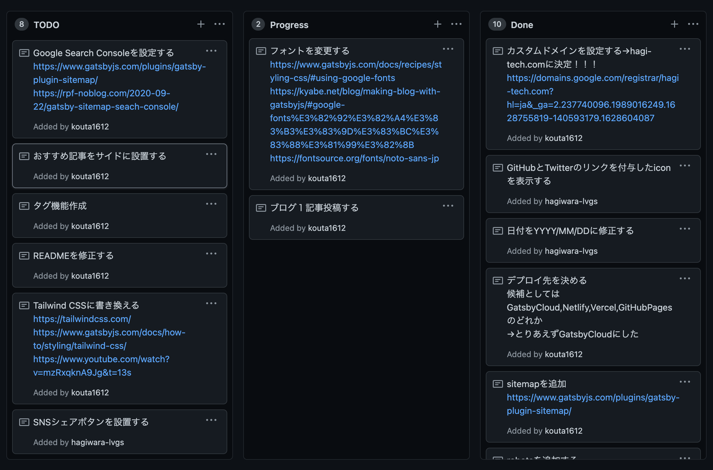

## GatsbyJSを採用した背景
結論から言うと、安く運用出来てカスタマイズがしやすいからです。
実は2年程前にWordPressでブログを運用していたのですが、初期費用と運用費だけで下記に示した金額くらいかかっていました。合計38,500円、年額15,200円。
気づいたらブログは閉鎖されてました。。
```txt
・初期費用
WordPressテーマ：20,000円
レンタルサーバー：3,300円
・運用費
ドメイン代：1,200円
レンタルサーバー：14,000円
```
今年のはじめ頃にアウトプットも兼ねて、少額でブログを運用したいと思うようになりました。
そこで、色々調べていく中でSSG(Static Site Generation)というのがブログサイトとの相性が良いと知り、GatsbyJSの存在を知りました。
SSGとは簡単に言うと、リクエスト時ではなくビルド時にDBやAPIからデータを取得して、レンダリングを行う技術です。詳しくは[こちらのサイト](https://zenn.dev/luvmini511/articles/1523113e0dec58#2.-ssg)が分かりやすかったです。
GatsbyJSの場合は、初期費用と運用費が下記に示した金額だけで済みます。
```txt
・初期費用
なし
・運用費
ドメイン代：1,400円
```
かかるのはドメイン代だけなので、年額1,400円だけです。月に換算すると100円くらい。
なぜこんなに安いのかというと、クラウドサーバを無料で利用しているからです。
個人で運用する場合は、今の時代だと基本的に無料でサービスを享受できるのです。いい時代ですなあ。
クラウドサーバはVercel,Netlify,GatsbyCloudがありますが、僕の場合はGatsbyを利用しているので相性が良さそうでかつ、簡単に連携できそうだったGatsbyCloudを選択しました。
カスタマイズの観点でいうと、広告の表示位置を自分で選ぶことが出来たり、独自ドメインを当て込みできるからです。要は柔軟性が良いものがいいなと思ったんですよね。
ライブドアブログやはてなブログは無料で運用できますが、広告の表示位置を自分で選択出来なかったり、ドメインはブログ特有のフォーマットで決められてしまいます。
個人的に裁量権は自分が持っておくほうが、やりがいを感じて良いのかなと。
## 実装したこと
このブログは[gatsby-starter-blog](https://www.gatsbyjs.com/starters/gatsbyjs/gatsby-starter-blog)をもとに、ブログを作成しています。
localで下記コマンドを実行すると、簡単にブログを作成出来ます。
`gatsby new my-gatsby-project https://github.com/gatsbyjs/gatsby-starter-blog
`
ブログを作成するまでにやったことは、以下となります。
```txt
・GatsbyCloudとの連携
・GitHubにpushしたら自動でGatsbyCloudにデプロイされるよう設定
・プロフィール情報の変更、不要な画像を削除
・TwitterとGitHubへのリンクを設置
・日付のフォーマットを変更
・GoogleAnalytics、SitemapXML、robotsの追加
・GoogleFontに変更
```
一番ハマったのがTwitterとGitHubへのリンクを設置するときです。
僕はサーバサイドエンジニアなので、CSSをほとんど触ったことがありません。
なので、目的の位置にリンクを配置するだけでも苦労しました笑
## これから実装すること
タスク管理は、GitHub上にあるProjectsページで行っています。
こんな感じのよくあるかんばん方式で運用しています。


優先度の高い順にあげると以下のような感じです。
```txt
・GatsbyCloudのホスティングサービスとしてFirebaseを利用する
・GoogleSearchConsoleを追加
・プロフィールページを追加
・ヘッダーとフッターを追加
・SNSシェアボタンを設置
・タグ機能を作成
・おすすめ記事をサイドに表示
・サムネイル画像を追加
・TailwindCSSかCSS Modulesに書き直す
・既存のJavascriptをTypescriptに書き直す
```
既にGatsbyCloudにブログサイトをデプロイしているのですが、	ドメインがGatsbyCloud独自のフォーマットになっているんですよね。
独自ドメインに切り替えたいのですが、GatsbyCloudだけでは独自ドメインに切り替え出来ないそうです。切り替えるにはGatsbyCloudとホスティングサービスとを連携する必要があるみたいです。僕の場合はGoogle先生に多大なる信頼をおいているので、Firebaseホスティングサービスと連携しようかと考えています。
ドメインはもう[Google Domain](https://domains.google.com/)で取得できているので、この記事を書いたあとにFirebaseと連携して、ドメインを切り替えれば完了です。この記事が上がっている頃には完了してると思います。
ブログのページ以外にもプロフィールページやお問い合わせページを作成したいですね。
でも、お問い合わせページはイタズラが来そうで怖いので、必要が出てきてから作成しても良いかなと思ってます。
記事が増えてきたら、タグやおすすめ記事をサイドに表示するようにしていきたいですね。余裕が出来たらサムネイル画像も貼っていきたいです。
既存のCSSやJavascriptを置き換えるについては、見た目に関しては特に変化がなく時間をとるので、優先度は低いです。ただTypescriptについても知見を深めていきたいので後々置き換えていきたいです。